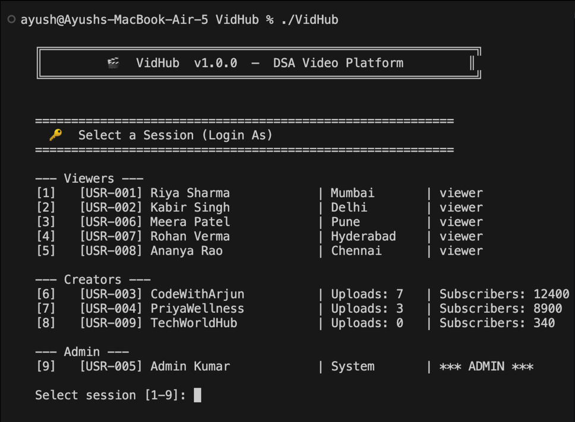
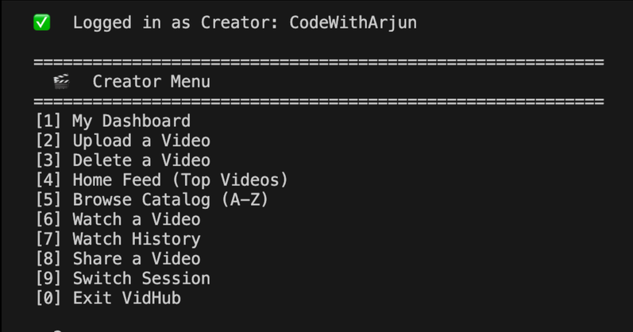
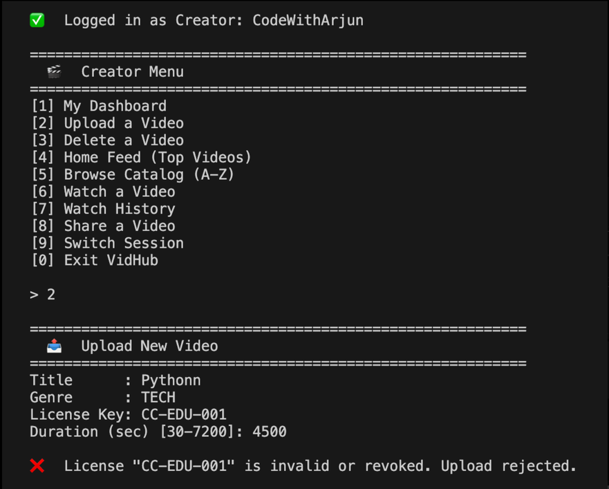
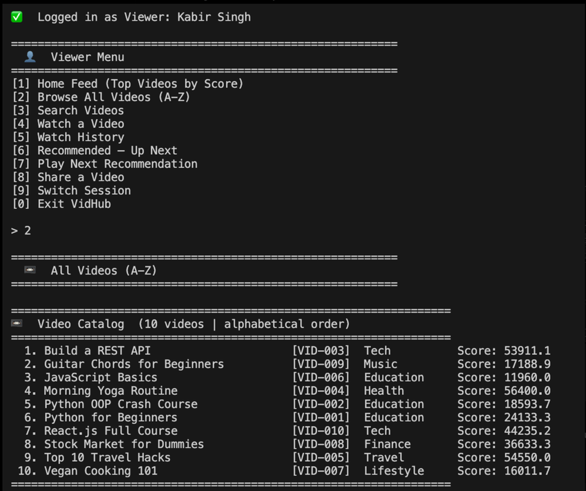
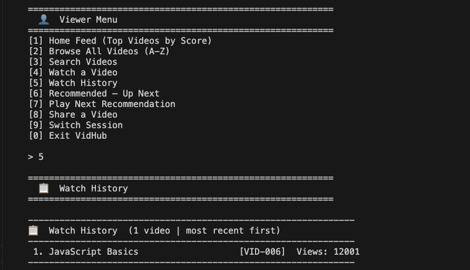

# 🎬 VidHub — Data Structures & Algorithms Video Platform

Welcome to **VidHub**, a premium console-based video platform simulation that demonstrates the practical application of core Data Structures and Algorithms (DSA) in a modern system architecture. 

VidHub simulates user flows for viewers, content creators, and administrators—orchestrating everything from recommendation algorithms and license verification to network distribution paths and sharing networks.

---

## 📝 Problem Statement

Modern video streaming networks operate at massive scale, processing millions of videos daily while serving millions of concurrent users. At this volume, naive data management strategies and generic database queries quickly become performance bottlenecks. Efficient, custom-tailored data structures and algorithms (DSA) are critical to maintaining high responsiveness, low latency, and low memory overhead. 

VidHub addresses this environment by simulating key real-world challenges, including:
* **Large Catalog Search**: Quickly searching and sorting alphabetically across extensive video libraries.
* **Watch History Tracking**: Storing and retrieving the user's latest watched items with minimal resource consumption.
* **Instant License Verification**: Validating upload permissions and verifying media copyright ownership instantly.
* **Dynamic Content Ranking**: Computing engagement metrics in real-time to highlight popular content.
* **Playlist Recommendations**: Organizing sequential streams of related content for continuous playback.
* **Social Sharing Networks**: Tracing user sharing nodes to measure content reach.
* **CDN Delivery Optimization**: Selecting the lowest-latency server paths to stream chunks to the end-user.

---

## 🎯 Objectives

The objective of VidHub is to demonstrate how core Data Structures and Algorithms can be integrated into a cohesive, simulation-driven media platform. The project sets out to:
* **Organize content catalogs** alphabetically using balanced binary search trees.
* **Track watch history** dynamically for each session using a low-overhead stack.
* **Generate recommendations** sequentially to curate a viewer's "Up Next" feed.
* **Verify copyright licenses** instantly to authorize uploads and validate content distribution.
* **Rank content** dynamically based on user engagement metrics (views, likes, watch time).
* **Model sharing networks** to map social paths and analyze how media reaches target communities.
* **Optimize CDN delivery routes** to minimize user latency by finding shortest paths on latency-weighted graphs.
* **Simulate streaming** by managing segment chunks dynamically during playback.

---

## 🏗️ System Overview & Architecture

VidHub is designed with a modular architecture that separates interface logic, domain entities, core algorithmic engines, and utility helpers. The system is split into four primary layers:
* **`ui/` Layer ([ConsoleUI](file:///Users/ayush/DSA-exam/VidHub/ui/ConsoleUI.h))**: Serves as the interactive CLI loop. It accepts user inputs, displays role-based menus (Viewer, Creator, Admin), and drives user sessions.
* **`modules/` Layer**: Contains the algorithmic core. When the user takes an action in `ConsoleUI`, the UI layer delegates it to these modules (e.g., [VideoCatalog](file:///Users/ayush/DSA-exam/VidHub/modules/VideoCatalog.h), [WatchHistory](file:///Users/ayush/DSA-exam/VidHub/modules/WatchHistory.h), [DeliveryOptimizer](file:///Users/ayush/DSA-exam/VidHub/modules/DeliveryOptimizer.h)). The modules implement the custom data structures and algorithm steps.
* **`entities/` Layer**: Defines the data models (e.g., [Video](file:///Users/ayush/DSA-exam/VidHub/entities/Video.h), [User](file:///Users/ayush/DSA-exam/VidHub/entities/User.h), [Creator](file:///Users/ayush/DSA-exam/VidHub/entities/Creator.h), [Admin](file:///Users/ayush/DSA-exam/VidHub/entities/Admin.h)). The modules perform operations directly on these entity objects, updating and querying their attributes (like views, likes, or user properties).
* **`utils/` Layer ([Helpers](file:///Users/ayush/DSA-exam/VidHub/utils/Helpers.h))**: Provides supporting utilities (such as string formatting, case-insensitive matches, and helper conversions) used across the other layers.

---

## 🚀 Key Features & DSA Architecture

Each module in VidHub is built using a custom or optimized Data Structure to solve a real-world system design challenge:

| Feature / Module | Data Structure Used | Purpose |
| :--- | :--- | :--- |
| **Watch History** | **Stack (LIFO)** | Keeps track of recently watched videos, allowing viewers to see their history with the most recent first. |
| **Recommendation Queue** | **Queue (FIFO)** | Manages the "Up Next" play queue, populating recommendations based on the active video's genre. |
| **License Registry** | **Hash Map** | Provides $O(1)$ fast lookup and verification of video license keys (e.g., MIT, Creative Commons, Proprietary). |
| **Video Catalog** | **Binary Search Tree (BST)** | Stores and searches all platform videos sorted alphabetically (A-Z). Supports rapid lookup and insertion. |
| **Ranking System** | **Max Heap (Priority Queue)** | Ranks all platform videos dynamically based on popularity score (combination of views, likes, and watch time). |
| **Video Segment Manager** | **Deque (Double-Ended Queue)** | Simulates segment buffering and playback. Allows pre-appending for repairs, appending for streaming, and seek operations. |
| **Sharing Network** | **Directed Graph** | Model connections between users and platforms. Supports BFS (for hop levels and reach analysis) and DFS. |
| **CDN Delivery Optimizer** | **Weighted Graph + Dijkstra** | Computes the optimal (lowest latency) network path from media origins through PoPs and Edge servers to the user. |

---

## 🛠️ Implementation Approach

Each core module utilizes standard or custom components to achieve optimal time and space complexity:
* **Watch History**: Implemented using `std::stack` to hold `Video` objects. It enforces a maximum capacity by popping the oldest elements from the bottom when new items are added, providing LIFO `O(1)` operations.
* **Recommendation Queue**: Built using `std::queue` to manage the playback queue. It automatically searches the global list of videos for matching genres to populate recommendation suggestions in FIFO order.
* **License Registry**: Uses `std::unordered_map` linking license keys (string) to `LicenseInfo`. This allows constant-time verification, registration, and removal.
* **Video Catalog**: Implemented via a custom binary search tree (`BSTNode` struct) to store videos sorted alphabetically by title. It performs custom in-order traversals and recursive BST node insertion/removal.
* **Ranking System**: Employs `std::priority_queue` configured as a Max Heap, along with an `std::unordered_map` for instant score updates. When engagement metrics change, the heap is rebuilt to keep the leaderboard accurate.
* **Video Segment Manager**: Utilizes `std::deque` to store `Segment` chunks. This supports double-ended appending (for live streaming), prepending (for priority repair buffers), and `O(1)` random access seeking.
* **Sharing Network**: Models interactions as a directed graph using an adjacency list (`std::unordered_map` mapping user IDs to vectors of destination user IDs). It supports BFS (for reachability levels) and DFS traversal.
* **CDN Delivery Optimizer**: Configured as an adjacency list representation of a weighted graph. It implements Dijkstra’s algorithm using a min-priority queue (`std::priority_queue` with `std::greater`) to calculate the lowest latency paths.

---

## ⏱️ Time and Space Complexity Analysis

The following table summarizes the time and space complexity for all key DSA operations in VidHub:

| Operation / Module | Time Complexity | Space Complexity | Notes / Auxiliary Space |
| :--- | :--- | :--- | :--- |
| **Video Search (BST)** | `O(log n)` (average) / `O(n)` (worst) | `O(log n)` (average) / `O(n)` (worst) | Space is recursion stack depth. Worst case occurs if the BST becomes skewed. |
| **Video Insert (BST)** | `O(log n)` (average) / `O(n)` (worst) | `O(log n)` (average) / `O(n)` (worst) | Space is recursion stack depth. |
| **Stack Push** | `O(1)` | `O(1)` | Constant-time insert for watch history. Total space is `O(N)` for `N` elements. |
| **Queue Insert** | `O(1)` | `O(1)` | Constant-time enqueue for recommendation play queues. |
| **License Verification** | `O(1)` (average) / `O(n)` (worst) | `O(1)` auxiliary | Hash Map key lookup in `std::unordered_map`. |
| **Heap Insert** | `O(log n)` | `O(1)` auxiliary | Sift-up/sift-down operations on the max-heap priority queue. |
| **Graph Traversal (BFS/DFS)**| `O(V + E)` | `O(V)` | BFS uses a queue; DFS uses a call stack. Both track visited nodes in a set. |
| **Dijkstra's Algorithm** | `O((V + E) log V)` | `O(V + E)` | CDN route calculation using a min-heap priority queue. |
| **Deque Operations** | `O(1)` | `O(1)` | Appending to back, prepending to front, or accessing segments by index. |

---

## 🛠️ Execution Steps (Getting Started)

### Prerequisites
* A C++ compiler supporting **C++17** (e.g., `g++` or `clang++`).
* `make` build utility.

### Compilation
Build the main application and all unit test binaries:
```bash
make
```

### Running the Application
Launch the interactive console UI:
```bash
./vidhub
```

### Running Unit Tests
VidHub includes individual unit tests for every module to ensure correctness:
```bash
make test_all
```
This compiles and runs the individual tests:
* `./test_video`
* `./test_entities`
* `./test_wh` (Watch History)
* `./test_rq` (Recommendation Queue)
* `./test_lr` (License Registry)
* `./test_cat` (Video Catalog BST)
* `./test_rs` (Ranking System Max Heap)
* `./test_seg` (Segment Manager Deque)
* `./test_sn` (Sharing Network Graph)
* `./test_do` (Delivery Optimizer Dijkstra)

---

## 📂 Project Structure

```
VidHub/
├── data/
│   ├── DummyData.h / .cpp       # Generates sample users, creators, videos, and network nodes
│   └── ...
├── entities/
│   ├── Video.h / .cpp           # Core metadata structure (views, likes, score, duration)
│   ├── User.h / .cpp            # User properties (viewer credentials)
│   ├── Creator.h / .cpp         # Creator properties & uploaded catalog references
│   └── Admin.h / .cpp           # Administrative actions
├── modules/
│   ├── WatchHistory.h / .cpp    # Stack implementation
│   ├── RecommendationQueue.h    # Queue implementation
│   ├── LicenseRegistry.h        # Hash Map implementation
│   ├── VideoCatalog.h / .cpp    # BST implementation
│   ├── RankingSystem.h / .cpp   # Max Heap implementation
│   ├── VideoSegmentManager.h    # Deque implementation
│   ├── SharingNetwork.h / .cpp  # Directed Graph BFS/DFS
│   └── DeliveryOptimizer.h      # Weighted Graph & Dijkstra's Algorithm
├── samples/
│   ├── <module>_input.txt       # Example inputs used in automated testing drivers
│   ├── <module>_output.txt      # Direct captured console outputs of unit tests
│   └── README.md                # Summary index of module test cases
├── ui/
│   ├── ConsoleUI.h / .cpp       # Command Line Interface (CLI) loop and menus
│   └── ...
├── utils/
│   └── Helpers.h                # String transformation helpers
├── Makefile                     # Compiler directives and target configurations
└── README.md                    # Project documentation
```

---

## 📥 Sample Inputs and Outputs

The [samples/](file:///Users/ayush/DSA-exam/VidHub/samples/) directory contains test drivers, input text files, and captured terminal outputs for each core module. A brief overview of these files is available in [samples/README.md](file:///Users/ayush/DSA-exam/VidHub/samples/README.md).

Below are two inline examples showing input datasets and their corresponding execution outputs.

### Example 1: License Registry Hash Map Verification
* **Simulated Input (from [license_registry_input.txt](file:///Users/ayush/DSA-exam/VidHub/samples/license_registry_input.txt))**:
  ```text
  Key: MIT-AJ-002    Owner: Arjun Dev   Type: MIT         Expiry: 2026-06-01  Active: True
  Key: CC-EDU-001    Owner: CodeBase    Type: CC          Expiry: 2025-12-31  Active: True
  
  Operations:
  1. Register both licenses.
  2. Reject duplicate registration of "MIT-AJ-002".
  3. Revoke "CC-EDU-001".
  ```
* **Captured Execution Output (from [license_registry_output.txt](file:///Users/ayush/DSA-exam/VidHub/samples/license_registry_output.txt))**:
  ```text
  [PASS] registerLicense() — 5 licenses added
  [PASS] Duplicate key rejected (count still 5)
  [PASS] verify() returns true for 3 active licenses
  [PASS] revokeLicense() — CC-EDU-001 revoked (entry preserved)
  [PASS] verify() returns false for revoked license
  ```

### Example 2: Content Ranking Score Calculation
* **Simulated Input (from [ranking_system_input.txt](file:///Users/ayush/DSA-exam/VidHub/samples/ranking_system_input.txt))**:
  ```text
  Video: Python for Beginners (VID-001) | Views: 22,400 | Likes: 1,800 | Watch Time: 22,400s
  Video: Morning Yoga Routine (VID-004) | Views: 38,100 | Likes: 2,800 | Watch Time: 38,100s
  
  Operations:
  1. Add both to Ranking System.
  2. Retrieve top ranked video.
  3. Simulate "Python for Beginners" going viral (Views: 500,000 | Likes: 50,000).
  ```
* **Captured Execution Output (from [ranking_system_output.txt](file:///Users/ayush/DSA-exam/VidHub/samples/ranking_system_output.txt))**:
  ```text
  [PASS] addVideo() — 6 videos added
    Top video: Morning Yoga Routine (score=56400)
  [PASS] getTopK(3) returns 3 videos in descending score order
    Rank 1: Morning Yoga Routine (56400)
    Rank 2: Top 10 Travel Hacks (54550)
  
    Updating VID-001 score to: 850000
  [PASS] updateVideo() — VID-001 now at top after score update
  ```

---

## 🖼️ Screenshots of Execution

The following screenshots capture the execution menus and outputs of VidHub's interactive console session:

| Screen Interface | Captured Output |
| :--- | :--- |
| **Login Screen** |  <br> *Figure 1: Application Login Interface* |
| **Creator Dashboard** |  <br> *Figure 2: Creator Dashboard* |
| **License Verification** |  <br> *Figure 3: License Validation* |
| **Video Catalog** |  <br> *Figure 4: Video Catalog* |
| **Watch History** |  <br> *Figure 5: Watch History* |

---

## 📈 Results and Observations

The VidHub simulation successfully verified the correctness and efficiency of core data structures across several media delivery workflows:
* **Efficient Content Organization (BST)**: Organizing the global video catalog in a binary search tree enables rapid alphabetical search queries in logarithmic `O(log n)` time on average, preventing performance degradation.
* **Fast Watch History (Stack)**: Implementing watch history with a LIFO stack allows the user's latest watched items to be logged in constant `O(1)` time, maintaining immediate access to recent actions.
* **Ordered Recommendations (Queue)**: The recommendation queue correctly processes video playback order in FIFO sequence, offering automated recommendations with negligible overhead.
* **Instant License Checks (Hash Map)**: The license registry uses an `std::unordered_map` to verify licensing keys in constant `O(1)` average time, preventing unauthorized creator uploads dynamically.
* **Priority Ranking (Max Heap)**: The Max Heap implementation dynamically adjusts popular videos based on likes and views, allowing the platform to serve real-time leaderboard rankings in `O(log n)` update times.
* **Social Network Modeling (Graphs)**: Directed graph models of users and content sharing paths successfully track sharing connections, computing propagation reach and hop counts via BFS/DFS traversals.
* **Shortest-Path Latency (Dijkstra)**: The Delivery Optimizer calculates minimum-cost CDN paths in weighted graphs using Dijkstra's algorithm, routing traffic dynamically through nodes to minimize delay.
* **Adaptive Streaming (Deque)**: Double-ended queues allow the segment buffer to support `O(1)` seek access, fast appending for live streaming chunks, and prepending for higher-priority repairs.

---

## 🏁 Conclusion

VidHub demonstrates a robust console-based architecture for a video streaming platform, showing how standard C++ STL and custom-designed data structures can solve multi-layered architectural problems. By mapping each domain challenge (cataloging, history, buffering, social networks, and content distribution) to its optimal data structure and algorithmic solution, VidHub models how high-performance systems scale efficiently under data-intensive operations.

---

## 👥 Interactive Sessions

When you run `./vidhub`, you can log in under three different roles:
1. **Viewer**: Browse Top Feed, search by keyword/genre (BST search), play/like videos (updating Max Heap dynamically), see watch history (Stack), and share videos with other users (Graph).
2. **Creator**: View upload dashboard, upload new videos (requires validation against Hash Map license registry), delete videos, and share videos.
3. **Admin**: View system analytics, inspect/revoke licenses, print/traverse the sharing network graph, and run the CDN latency path simulator.
